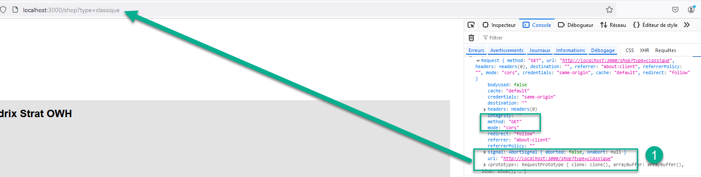
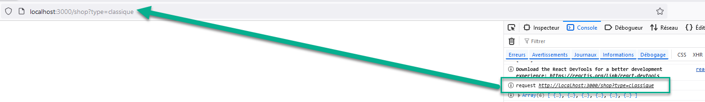
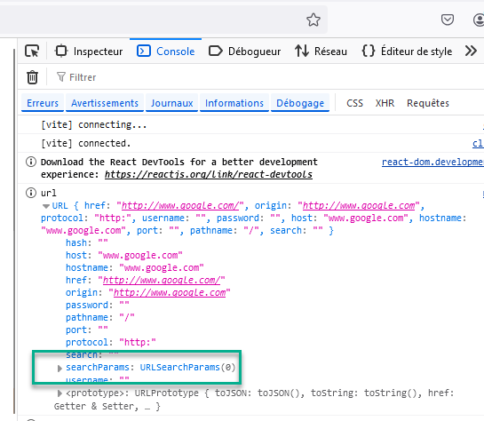
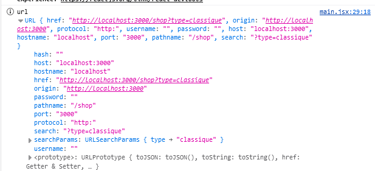
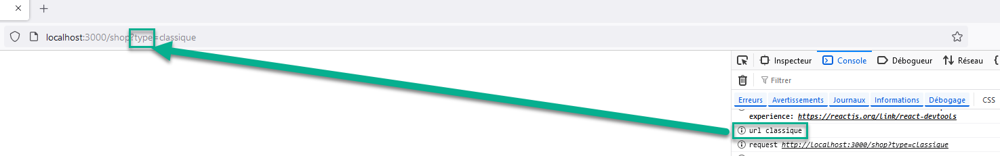
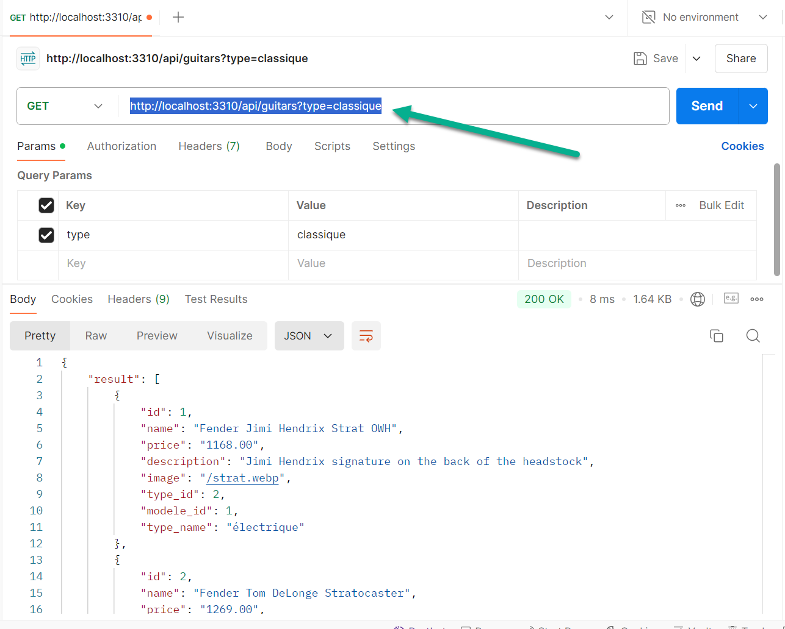
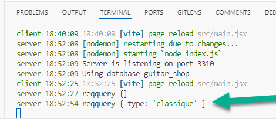
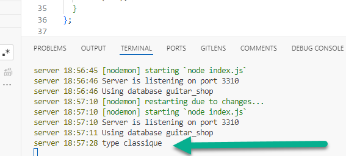
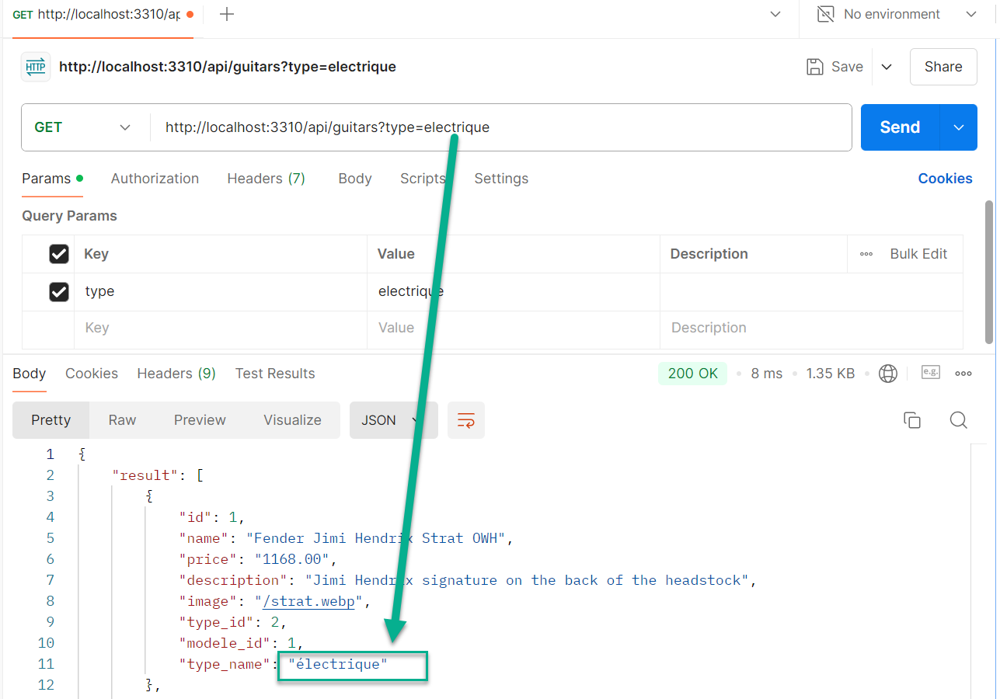
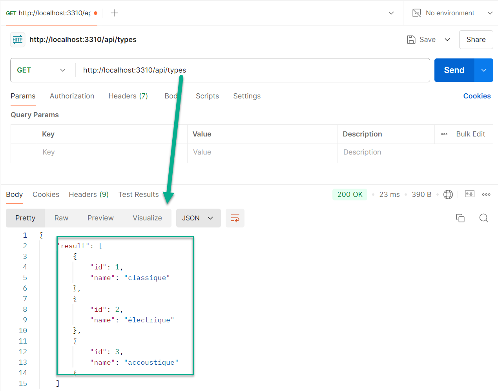

# filtrer à partir du server

résultat attendu : localhost:3000/shop?type=acoustique

## inspection la console sur la page web

### Allons voir ce que retourne le loader ici

je veux pouvoir récupérer des queries => aller sur client, et sur main.jsx et modifier le loader du chemin sélectionné

```jsx
      {
        path: "/shop",
        element: <Shop />,
        loader: ({ request }) => {
          console.info("request", request);
          return getGuitars();
        },
      }
```

regardons la console et voici ce qu'on voit pour url:



### allons chercher l'url

```jsx
      {
        path: "/shop",
        element: <Shop />,
        loader: ({ request }) => {
          console.info("request", request.url);
          return getGuitars();
        },
      }
```



### créer une instance d'url en exemple dans loader

```jsx
      {
        path: "/shop",
        element: <Shop />,
        loader: ({ request }) => {
          const url = new URL("www.google.com");
          console.info("url", url);
          console.info("request", request.url);
          return getGuitars();
        },
      },
```

on y trouve une fonction searchParams


### remplacer l'exemple url par request.url

```jsx
      {
        path: "/shop",
        element: <Shop />,
        loader: ({ request }) => {
          const url = new URL(request.url);
          console.info("url", url);
          console.info("request", request.url);
          return getGuitars();
        },
      },
```



### executons search params

```jsx
      {
        path: "/shop",
        element: <Shop />,
        loader: ({ request }) => {
          const url = new URL(request.url);
          console.info("url", url.searchParams.get("type"));
          console.info("request", request.url);
          return getGuitars();
        },
      },
```

il a donc récupérer le params de l'url



## allons voir le backend

### ouvrir postman et mettre url avec la query api et le bon url



### aller dans server et le controlleur à modifier

#### ajouter console

```js
const browse = async (req, res, next) => {
  try {
    console.info("reqquery", req.query);
    const guitars = await tables.guitar.readAll();

    if (guitars.length === 0) {
      res.json({
        message: "Pas de guitares",
        result: guitars,
      });
    } else {
      res.json({ result: guitars });
    }
  } catch (err) {
    next(err);
  }
};
```

relancer postman et voilà resultat 

#### destructurer cette console

```js
const browse = async (req, res, next) => {
  try {
    const { type } = req.query;
    console.info("type", type);
    const guitars = await tables.guitar.readAll();

    if (guitars.length === 0) {
      res.json({
        message: "Pas de guitares",
        result: guitars,
      });
    } else {
      res.json({ result: guitars });
    }
  } catch (err) {
    next(err);
  }
};
```

on arrive à récupérer le type=> 

#### ajouter argument type dans readAll

```js
const browse = async (req, res, next) => {
  try {
    const { type } = req.query;
    const guitars = await tables.guitar.readAll(type);

    if (guitars.length === 0) {
      res.json({
        message: "Pas de guitares",
        result: guitars,
      });
    } else {
      res.json({ result: guitars });
    }
  } catch (err) {
    next(err);
  }
};
```

### aller dans server et le model à modifier

#### ajouter le paramètre type dans readall et faisons une nouvelle query sql

```js
  async readAll(type) {
    if (!type) {
      const [rows] = await this.database.query(
        `select guitar.*, type.id as type_id, type.name as type_name from ${this.table} join type on guitar.type_id = type.id`
      );
      return rows;
    }
    const [rows] = await this.database.query(
      `select guitar.*, type.id as type_id, type.name as type_name from ${this.table} join type on guitar.type_id = type.id where type.name = ?`,
      [type]
    );

    return rows;
  }

```

le filtre fonctionne dans le backend maintenant


### afin de mettre un filtre dans frontend, il faut récupérer une liste=>

créer model, router, controlleur
modifier tables

model.js

```js
  async readAll() {
    const [rows] = await this.database.query(`select * from ${this.table}`);
    return rows;
  }

```

table.js

```jsx
const TypeRepository = require("./models/TypeRepository");
tables.type = new TypeRepository();
```

router.js

```jsx
const typeActions = require("../../controllers/typeActions");
router.get("/types", typeActions.browse);
```

controlleur.js

```js
const tables = require("../../database/tables");

const browse = async (req, res, next) => {
  try {
    const types = await tables.type.readAll();

    if (types.length === 0) {
      res.json({
        message: "Pas de types",
        result: types,
      });
    } else {
      res.json({ result: types });
    }
  } catch (err) {
    next(err);
  }
};
module.exports = {
  browse,
};
```

sur postman, il y a bien la liste: 

## retournons au frontend

### créer une requete dans services pour récupérer api

request.js
on récupère la liste et aussi les guitares filtrées dans api

```js
export function getTypes() {
  return axios
    .get(`${import.meta.env.VITE_API_URL}/api/types`)
    .then((response) => response.data.result)
    .catch((error) => console.error(error));
}

export function getGuitarsByType(type) {
  return axios
    .get(`${import.meta.env.VITE_API_URL}/api/guitars?type=${type}`)
    .then((response) => response.data.result)
    .catch((error) => console.error(error));
}
```

main.jsx

```jsx
      {
        path: "/shop",
        element: <Shop />,
        loader: async () => {
          const guitars = await getGuitars();
          const types = await getTypes();
          console.info("guitars", guitars);
          console.info("types", types);

          return {
            guitars,
            types,
          };
        },
      },
```

component.jsx ou page.jsx

```jsx
import { useLoaderData } from "react-router-dom";
import { useState, useEffect } from "react";
import { getGuitarsByType } from "../services/request";

import GuitarCard from "../components/GuitarCard";

export default function Shop() {
  const filteredguitars = useLoaderData();

  const [guitars, setGuitars] = useState([]);
  const { types } = filteredguitars;
  const [filterType, setFilterType] = useState("");

  const handleChange = (event) => {
    setFilterType(event.target.value);
  };

  useEffect(() => {
    getGuitarsByType(filterType).then((data) => {
      setGuitars(data);
    });
  }, [filterType]);

  // vérifier si filterType fonctionne
  console.info("filtertype", filterType);

  return (
    <>
      <h1>Mon shop</h1>
      <select onChange={handleChange}>
        <option value="">Tous les types</option>
        {types.map((type) => (
          <option value={type.name} key={type.id}>
            {type.name}
          </option>
        ))}
      </select>
      {guitars.map((guitar) => (
        <GuitarCard guitar={guitar} key={guitar.id} />
      ))}
    </>
  );
}
```
